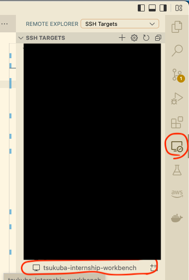

# Setup

講義を開始する前に、講義で使うための EC2 インスタンスにログインする準備をします。皆さんには事前にインスタンスの IP アドレスと、そのインスタンスにログインするための秘密鍵をお渡しします。

受け取った秘密鍵は SSH ログインで利用可能なように次の操作を行ってください。

```
$ chmod 600 tsukuba-container-internship-2022.pem
$ mv tsukuba-container-internship-2022.pem ~/.ssh
```

次に、~/.ssh/config に、インスタンスにログインするための設定を追加します。

```
Host tsukuba-internship-workbench
  User ubuntu
  HostName ${インスタンスの IP アドレス}
  Port 22
  IdentityFile ~/.ssh/tsukuba-container-internship-2022.pem
```

では、VS Code から接続してみましょう。画面端の Remote Explorer のアイコンを探し、SSH TARGETS から、さきほど ~/.ssh/config に追加した tsukuba-internship-workbench を探し、右クリックして「Connect to Host in Current Window」を選択します。もしくは、右の + マークのついた窓のアイコンをクリックすると、別ウィンドウで開くこともできます。



以下のスクリーンショットのような表示になっていれば、接続に成功しています。


その状態でメニューバーの「View - Terminal」をクリックするか <kbd>Ctrl</kbd> + <kbd>`` ` ``</kbd> を押すことで、VS Code に付属しているターミナルを開くことができます。適当にコマンドを打って動作確認してみてください。以下のスクリーンショットのように `code` コマンドを利用すると SSH ログインした状態の VS Code 上のファイルを編集することもできます。


インスタンス上で Vim を使いたい場合や、エディタは VS Code でいいけれどターミナルは手に馴染んだものを使いたい場合にターミナルからログインするときは、

```
$ ssh tsukuba-internship-workbench
```

のようにしてください。

ログインが完了して `ls` などの適当なコマンドが動けばセットアップは完了です。
